# IN-Maps
this is India one of the map app where you can find routes , navigation , POI(Point Of Interest) Many more..

## Login and SignUp pages
  

## Map Features
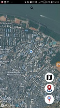 &nbsp; 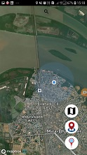 &nbsp; 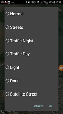
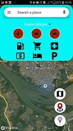 &nbsp; 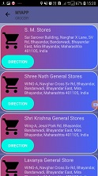 &nbsp; 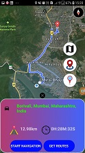
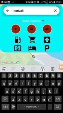 &nbsp; 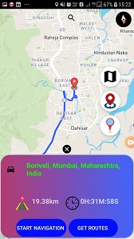 &nbsp; 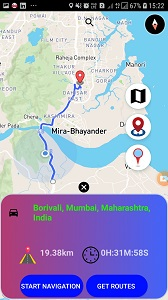

## Navigation Features
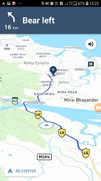 &nbsp; 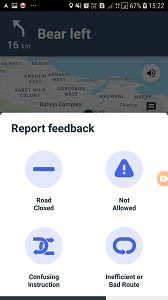

## News Features
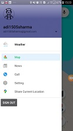 &nbsp;  &nbsp;  &nbsp; 

## Weather Feature
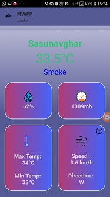

## Emergency Call Feature
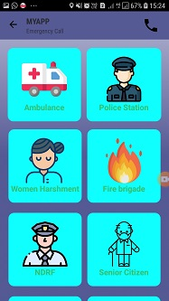

# What Platform we used
## This are the platform i used to build IN-Maps it is built only for android device
 &nbsp;  &nbsp; ; 
